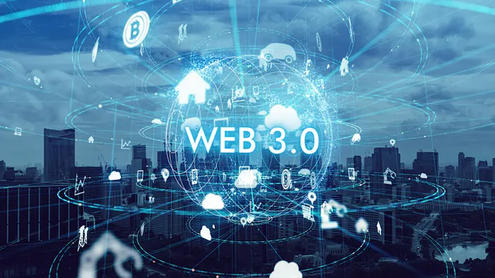
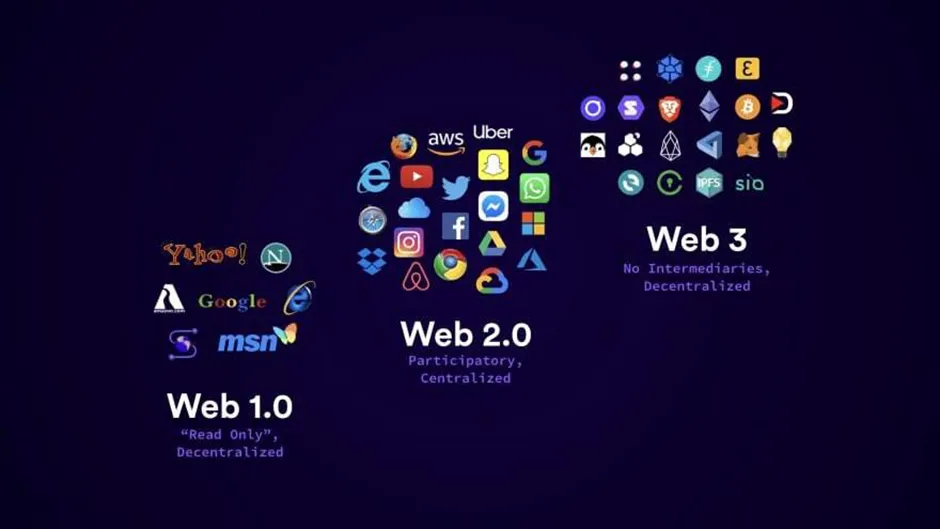

import imageNayanBari from '@/images/team/nayan-bari.jpg'

export const article = {
  date: '2023-02-16',
  title: 'Web 3.0 — A paradigm shift in Web Technology',
  description:
    'The world wide web, also known as the web is nothing but a group of webpages that can be accessed by users through web browsers using the Internet',
  author: {
    name: 'Nayan Bari',
    role: 'Lead Frontend Developer',
    image: { src: imageNayanBari },
  },
}

export const metadata = {
  title: article.title,
  description: article.description,
}

The world wide web, also known as the web is nothing but a group of webpages that can be accessed by users through web browsers using the Internet. It provides creators the opportunity to showcase their products or work to the world and also interact with customers through services like selling and buying.

## Introduction

WWW was created in 1989 but it was not until 1991 that the first web technology emerged. Web 1.0 was a web technology that enabled a small number of publishers to write and display content for a larger audience. This was primarily achieved by static web pages. Due to the read-only nature of the technology, viewer participation was close to zero. This facilitated the development of second web technology called web 2.0 which tried to address this issue. With the introduction of Web 2.0 in 2003, the static nature of websites in web 1.0 changed to dynamic. This ensured optimal consumer or viewer participation making the website more and more dynamic. The new technology also enabled publishers to cater to an even larger audience. Though web 2.0 opened doors for viewers to actively share their thoughts and views, this also increased the risk of data overload. Furthermore, hacking and data piracy was also a major challenge. These disadvantages can be credited to the fact that all the data in Web 2.0 is centralized. These cons were addressed in 2014 when web 3.0 was introduced. A technology that incorporated a completely new method of data storage and decentralization of data was set to take the world by surprise.

Web 3.0 is still a “Work in progress” project given the fact that it’ll take another 4–5 years to get the technology grooving. It succeeds web 2.0 and is mainly characterized by the decentralization of data. Decentralization of data means that not a single entity will have full control over all the data. This will make data piracies and other privacy issues rare. Currently, only big companies like Google and Microsoft hold most of the user’s data and this data is subject to piracy. To make web 3.0 a success, it needs to interact with the data. For this Artificial engineering and machine, learning will be put to work. To put it in simple words, Web 3.0 can be described as decentralized blockchain-based internet architecture.

## Differences with the previous webs

Web 1.0 which came out in 1991 was primarily characterized by static web pages which provided few publishers to cater to people. Web 2.0 went a step ahead and the static web pages changed to dynamic web pages which paved way for effective two-way communication between publishers and readers. However, web 2.0 was plagued by the problem of data privacy. Web 3.0 attempts to overcome this drawback by deploying distributed architecture.

Web 1.0 was based on a centralized architecture given the fact that anyone could host a server. This changed when web 2.0 was introduced as it was majorly based on a centralized architecture. Centralized infrastructure is characterized by very few owners doing the majority of data processing. This increases the risk of data privacy. Web 2.0 takes the help of cloud computing to make the infrastructure slightly decentralized but it remained largely centralized. While web 3.0 aims to make this infrastructure wholly decentralized.

## Key features of web 3.0

Some of the key features of web 3.0 are elaborated on below —

__Use of blockchain and cryptocurrency —__ Blockchain is nothing but a method of data storing in which the data is stored in form of blocks that are linked together. This provides for greater security of the data and reduces the number of security breaches. On the other hand, cryptocurrency is used as a medium to pay content creators through tokens.

__Integration of Artificial Intelligence —__ Artificial intelligence is used to make accurate predictions. It is one of the major technologies which drive web 3.0. Many Web 3.0 features like semantic web are made possible due to artificial intelligence.

__Decentralization —__ Decentralization is one of the key features that separates Web 3.0 from previous web technologies. Decentralization simply means the omission of all the intermediaries and no ownership of the data. This ensures better data protection and makes the system immune to any possible privacy breaches.

__Support for AR and VR —__ Augmented reality and Virtual reality are the hot topics among this generation. Metaverse as a whole is said to be the future of teaching and learning where students will be able to perform experiments and practicals in virtual reality which would have been difficult in the actual physical environment. Web 3.0 supports the metaverse thus paving the way for drastic changes in the fields of teaching, learning, gaming, etc.

## Working of Web 3.0

The main aim of web 3.0 is to make internet searches swift without compromising user data and privacy. The working of web 3.0 is different from its predecessors in many ways. If we talk about web 2.0, the user interacts with the front end which is connected to its backend. This backend is in turn connected to the database which maintains all the user data. All the information and code are saved on centralized servers.

As discussed earlier, decentralization is one of the key features of web 3.0 which distinguishes it from older web technologies. Therefore, instead of centralized servers, blockchain is used for saving the data in a decentralized manner. Users have control over their data and information and can sell or trade it without compromising security and privacy. Such content creators are paid for their work in form of cryptocurrencies or smart contracts.

## Applications of web 3.0

The Reliance on Web 3.0 on blockchain and AI enables it to facilitate various applications. Some of the applications are mentioned below —

__NFTs —__ NFTs are Non-fungible Tokens. If a creator or artist creates a unique art piece he or she can sell its NFT and earn money from it. Smart contracts are used for this purpose and Ethereum is used as a currency.

__DeFi —__ Decentralized finance is one of the emerging applications of Web 3.0. Earlier we discussed the demerits of centralized architecture and how it compromises the privacy and security of the data. This drawback gets magnified when it comes to centralized financing. In DeFi, blockchain is used as a basis for financial services. Blockchain in itself is based on a decentralized architecture.

__Cryptocurrencies__ — Cryptocurrency can be regarded as a virtual currency that makes use of cryptography. In today’s world where efforts are being made to replace conventional flat currency, Web 3.0 can play a major role in bringing forth Cryptocurrency as a modern and virtual currency replacing fiat currency. Apart from the aforementioned applications many more applications like dApp which are apps built on top of the blockchain, are taking shape and will increase the scope of Web 3.0 shortly.

## Conclision

As already discussed, Web 3.0 can be regarded as a “work in progress” project. It still needs to go through a lot of refinements to be finally able to cater to the audience. While there are numerous benefits of Web 3.0 which have the potential to revolutionize many fields like education and sports, it also has its share of demerits. These demerits hamper the scope of Web 3.0 and its efficiency. Also, the transition from web 1.0 and web 2.0 to web 3.0 will not be a smooth one given the fact that web 3.0 makes use of various technologies which may not be supported by existing devices.
